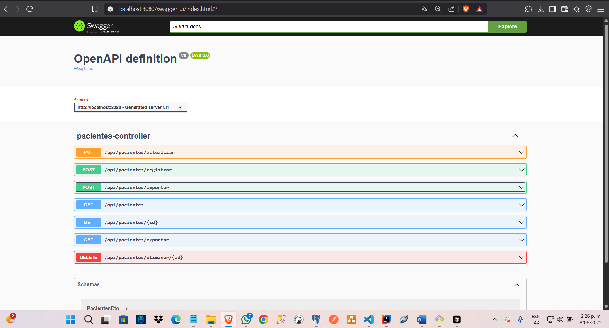
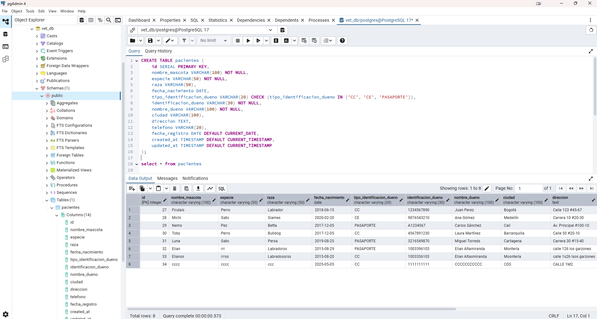
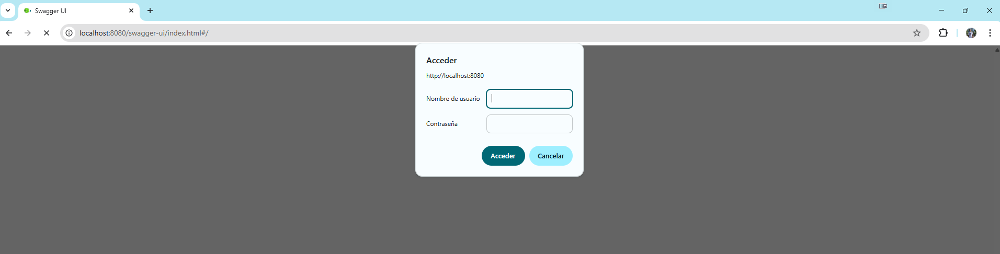

# Sistema de Gestión Veterinaria XYZ

## Descripción
Sistema de gestión para veterinaria que permite administrar pacientes (mascotas), incluyendo funcionalidades de registro, consulta, actualización y eliminación de pacientes, así como importación y exportación de datos en formato Excel.

## Arquitectura del Sistema

### Patrón de Arquitectura
El sistema implementa una arquitectura en capas (Layered Architecture) con las siguientes capas:

1. **Capa de Presentación (Controllers)**
   - Maneja las peticiones HTTP
   - Implementa los endpoints REST
   - Ubicación: `controladores/`

2. **Capa de Casos de Uso (CU)**
   - Implementa la lógica de negocio
   - Coordina las operaciones entre capas
   - Ubicación: `cu/`

3. **Capa de Dominio**
   - Contiene la lógica de negocio core
   - Se divide en:
     - `dominio/entidades/`: Modelos de dominio
     - `dominio/dao/`: Acceso a datos con JdbcTemplate
     - `dominio/manager/`: Gestores de negocio

4. **Capa de Transferencia de Datos**
   - `dto/`: Objetos de transferencia de datos
   - `mapper/`: Mapeo entre entidades y DTOs

### Patrones de Diseño Utilizados
1. **DAO (Data Access Object)**
   - Implementado en `dominio/dao/`
   - Usa JdbcTemplate para acceso a datos
   - Abstrae la persistencia de datos

2. **DTO (Data Transfer Object)**
   - Implementado en `dto/`
   - Separa la capa de presentación de la capa de dominio

3. **Mapper**
   - Implementado en `mapper/`
   - Usa MapStruct para mapeo automático
   - Convierte entre entidades y DTOs

## Base de Datos

### Esquema de Base de Datos
```sql
CREATE TABLE pacientes (
    id SERIAL PRIMARY KEY,
    nombre_mascota VARCHAR(100) NOT NULL,
    especie VARCHAR(50) NOT NULL,
    raza VARCHAR(50),
    fecha_nacimiento DATE,
    tipo_identificacion_dueno VARCHAR(20) NOT NULL,
    identificacion_dueno VARCHAR(20) NOT NULL,
    nombre_dueno VARCHAR(100) NOT NULL,
    ciudad VARCHAR(50),
    direccion VARCHAR(200),
    telefono VARCHAR(20),
    fecha_registro DATE NOT NULL,
    created_at TIMESTAMP NOT NULL,
    updated_at TIMESTAMP NOT NULL
);
```

### Configuración de Base de Datos
```properties
# Configuración PostgreSQL
spring.datasource.url=jdbc:postgresql://localhost:5432/vet_db
spring.datasource.username=postgres
spring.datasource.password=1234
spring.datasource.driver-class-name=org.postgresql.Driver
```

### Acceso a Datos
- Se utiliza JdbcTemplate para el acceso a datos
- Implementación en `dominio/dao/PacientesDao.java`
- Operaciones CRUD básicas:
  - Insert: `jdbcTemplate.update(sql, ...)`
  - Update: `jdbcTemplate.update(sql, ...)`
  - Delete: `jdbcTemplate.update(sql, id)`
  - Select: `jdbcTemplate.queryForObject(sql, ...)`
  - List: `jdbcTemplate.query(sql, ...)`

## Tecnologías Utilizadas

### Backend
- Java 21
- Spring Boot 3.4.6
- Maven
- PostgreSQL
- JdbcTemplate
- Apache POI (para manejo de Excel)
- OpenAPI/Swagger (documentación API)

## Requisitos Previos

> [!IMPORTANT]
> Asegúrate de tener estas herramientas instaladas antes de comenzar.

- Java 21 o superior
- Maven
- PostgreSQL
- IDE (recomendado: IntelliJ IDEA o Eclipse)

## Estructura del Proyecto
```
src/main/java/com/Prueba/veterinariaXYZ/
├── controladores/     # Controladores REST
├── cu/               # Casos de Uso
├── dominio/          # Lógica de Negocio
│   ├── dao/         # Acceso a Datos
│   ├── entidades/   # Entidades
│   └── manager/     # Gestores
├── dto/             # Objetos de Transferencia
├── exception/       # Manejo de Excepciones
└── mapper/          # Mapeadores
```

## Endpoints de la API

### Pacientes
- `GET /api/pacientes` - Listar todos los pacientes
- `GET /api/pacientes/{id}` - Obtener paciente por ID
- `POST /api/pacientes/registrar` - Crear nuevo paciente
- `PUT /api/pacientes/actualizar` - Actualizar paciente
- `DELETE /api/pacientes/eliminar/{id}` - Eliminar paciente
- `GET /api/pacientes/exportar` - Exportar pacientes a Excel
- `POST /api/pacientes/importar` - Importar pacientes desde Excel

## Documentación API (Swagger)
La documentación de la API está disponible en:
```
http://localhost:8080/swagger-ui.html
```

> [!NOTE]
> Esta URL te redirigirá a la interfaz de Swagger UI para probar los endpoints.

## Ejemplos de Uso

### Crear Paciente
```json
POST /api/pacientes/registrar
{
    "nombre_mascota": "Firulais",
    "especie": "Perro",
    "raza": "Labrador",
    "fecha_nacimiento": "2020-01-01",
    "tipo_identificacion_dueno": "CC",
    "identificacion_dueno": "123456789",
    "nombre_dueno": "Juan Pérez",
    "ciudad": "Bogotá",
    "direccion": "Calle 123",
    "telefono": "1234567890"
}
```

### Actualizar Paciente
```json
PUT /api/pacientes/actualizar
{
    "id": 1,
    "nombre_mascota": "Firulais",
    "especie": "Perro",
    "raza": "Labrador Retriever",
    "fecha_nacimiento": "2020-01-01",
    "tipo_identificacion_dueno": "CC",
    "identificacion_dueno": "123456789",
    "nombre_dueno": "Juan Pérez",
    "ciudad": "Bogotá",
    "direccion": "Calle 123 #45-67",
    "telefono": "1234567890"
}
```

## Importación/Exportación Excel

### Exportar Pacientes
- Endpoint: `GET /api/pacientes/exportar`
- Descarga un archivo Excel con todos los pacientes

### Importar Pacientes
- Endpoint: `POST /api/pacientes/importar`
- Formato: Archivo Excel (.xlsx)
- Columnas requeridas:
  - Nombre Mascota
  - Especie
  - Raza
  - Fecha Nacimiento
  - Tipo ID Dueño
  - ID Dueño
  - Nombre Dueño
  - Ciudad
  - Dirección
  - Teléfono

## Convenciones de Documentación
Se utilizan los siguientes bloques para destacar información importante en la documentación:

> [!NOTE]
> Aquí tienes una nota especial.

> [!TIP]
> Aquí tienes un consejo útil.

> [!IMPORTANT]
> Aquí tienes información importante.

## Capturas de Pantalla

### Swagger UI


### Base de Datos


### Credenciales de Acceso

> [!NOTE]
> Las credenciales de acceso para la autenticación básica son:
> - **Usuario**: `Elian`
> - **Contraseña**: `Elian0826*`

## Instalación y Ejecución

1. Clonar el repositorio
```bash
git clone [URL_DEL_REPOSITORIO]
```

2. Configurar la base de datos
- Crear base de datos PostgreSQL
- Actualizar credenciales en `application.properties`

> [!TIP]
> Asegúrate de que las credenciales en `application.properties` coincidan con tu configuración de PostgreSQL.

3. Compilar el proyecto
```bash
mvn clean install
```

4. Ejecutar la aplicación
```bash
mvn spring-boot:run
```

> [!TIP]
> Una vez que la aplicación se inicie, verás mensajes en la consola indicando que Spring Boot está activo.

5. Acceder a la aplicación
- API: http://localhost:8080
- Swagger UI: http://localhost:8080/swagger-ui.html

## Contribución
1. Fork el proyecto
2. Crear una rama para tu feature (`git checkout -b feature/AmazingFeature`)
3. Commit tus cambios (`git commit -m 'Add some AmazingFeature'`)
4. Push a la rama (`git push origin feature/AmazingFeature`)
5. Abrir un Pull Request

## Licencia
Este proyecto está bajo la Licencia MIT - ver el archivo [LICENSE.md](LICENSE.md) para más detalles. 
